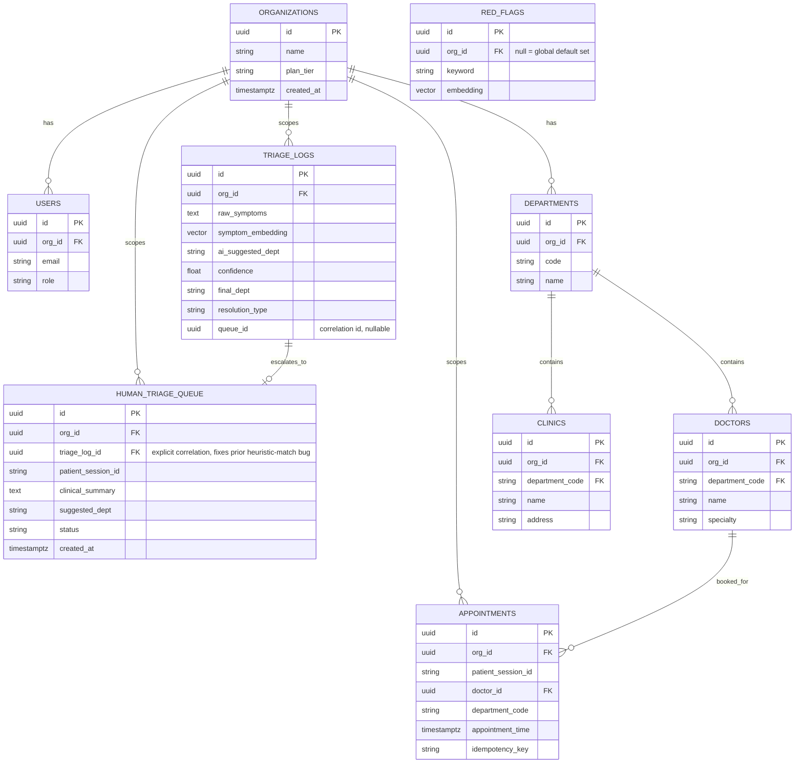
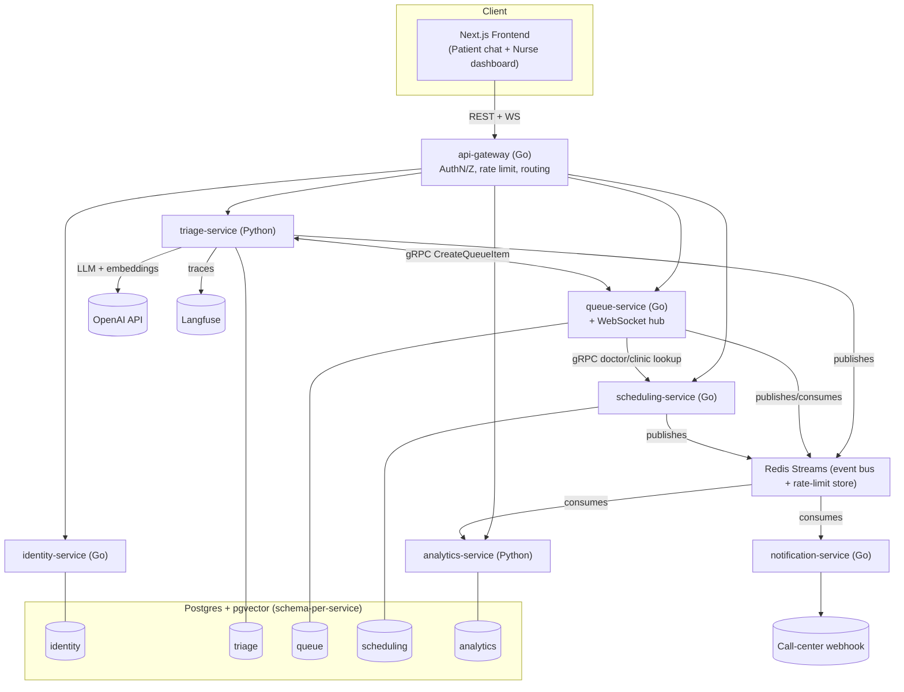
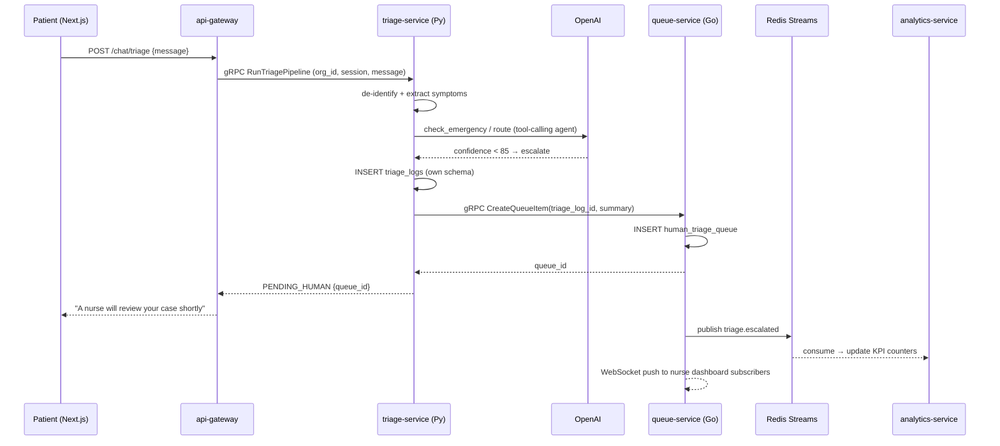
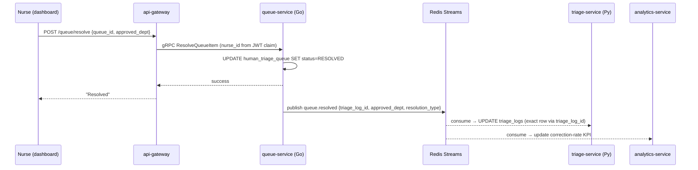
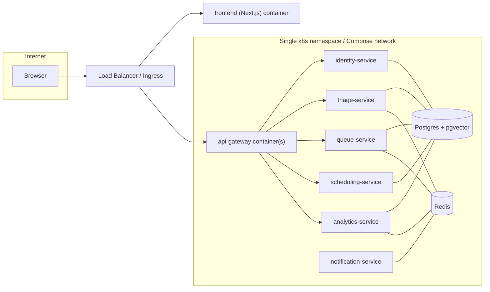

# Implementation Plan — TriageOS: Multi-Tenant AI Triage Platform (Go + Python Microservices)

## 0. Why this exists / what changed

The original hackathon build proved the concept. This plan rebuilds it as a portfolio-flagship product: a multi-tenant clinical-triage platform, decomposed into Go + Python microservices, shipped as one live seeded demo. Two decisions are now locked (previously open):

| Decision | Resolution |
|---|---|
| **Product shape** | "SaaS-*shaped*, demo-*operated*" — real multi-tenancy/RBAC/tenancy architecture, but hosted as one seeded demo. No real billing ops, no real sales/support/legal. |
| **Language split** | **Broadest-signal split, locked as designed:** Go for gateway, identity, queue, scheduling, notification (5 services) · Python for triage-service and analytics-service (2 services) — Python only where the AI/data ecosystem is the actual reason the code exists. |

Remaining open items are listed in §7 with a default applied so this plan can start moving now; flag any you want overridden.

---

## 1. Executive Summary

Rebuild the triage assistant as **TriageOS**: any clinic organization can onboard, configure its own departments/doctors, and get an AI-assisted patient-intake flow with a human-in-the-loop safety net — architected as independently deployable Go/Python services rather than one FastAPI monolith. Ship it as one publicly accessible, seeded demo (fictional clinic data only, zero real PHI, zero real hospital branding) with production-grade engineering practices: real auth/tenancy, a safety-eval-gated AI pipeline, and a recruiter-facing case-study README.

The two documents this supersedes each captured half the picture — the product PRD said *what* to build and *why*; the architecture doc said *how* to split it into services. This plan interleaves them into one build order, because several "product" requirements and "architecture" extractions are actually the same piece of work (e.g., "add real auth" *is* "stand up identity-service"; "fix the SLA sweep" *is* "extract queue-service").

---

## 2. Personas *(unchanged from the product PRD)*

| Persona | Description |
|---|---|
| **Hiring Manager / Interviewer** *(primary audience)* | ~10 minutes on the live demo + README. Judges architecture, security awareness, product framing — not just code style. |
| **Clinic Admin (tenant owner)** | Onboards a clinic workspace, configures departments/doctors/branding, invites nurses. |
| **Triage Nurse** | Logs into their clinic's dashboard only; reviews the 60–85%-confidence queue under SLA. |
| **Attending Doctor** | Flags mis-routed cases post-visit, feeding the correction loop. |
| **Patient (demo persona)** | Interacts with the chat widget using clearly-synthetic symptoms — never real health data. |
| **You (solo maintainer / on-call)** | Operates the one live deployment; needs it to stay up and cheap between interviews. |

---

## 3. Service Decomposition & Language Rationale

| Service | Language | Responsibility | Why this language |
|---|---|---|---|
| **api-gateway** | Go | Public entry point: JWT verification, per-tenant rate limiting, routing/composition, CORS, OpenAPI surface. | High-concurrency edge proxy — the one place raw throughput matters most. |
| **identity-service** | Go | Tenants (`organizations`), users, roles/membership, invites; validates/issues internal tokens. | Latency-sensitive CRUD + auth checks hit nearly every request; no ML involved. |
| **triage-service** | **Python** | AI pipeline: de-identification, symptom extraction, red-flag semantic check, LLM tool-calling agent, clinical-summary generation. Owns `triage_logs`, `red_flags` (pgvector). | The actual reason Python is in this stack: OpenAI SDK, prompt logic, eval tooling. |
| **queue-service** | Go | `human_triage_queue`, SLA timers, WebSocket hub for nurse dashboards (replaces Supabase Realtime), scheduled timeout sweep. | Realtime fan-out + timers = Go's sweet spot. |
| **scheduling-service** | Go | Directory (`departments`, `doctors`, `clinics`) + `appointments`; booking-conflict checks, idempotent booking. | Transactional CRUD, no AI involved. |
| **analytics-service** | **Python** | Consumes domain events, computes KPIs (auto-resolve rate, correction rate, SLA compliance, recall-eval trend); serves admin-dashboard reads; hosts the offline recall-eval batch job. | Reuses the same language/tooling as the required eval suite. |
| **notification-service** | Go | Consumes `queue.sla_breached` / `triage.emergency_detected`; triggers call-center escalation webhook. | Small, latency-sensitive consumer. |

**Unchanged:** Next.js frontend, Postgres + pgvector, OpenAI, Langfuse.
**New shared infra:** Redis — doubles as the distributed rate-limit store *and* the event bus (Redis Streams), reusing one dependency instead of adding Kafka/NATS on top.

> **Sizing honesty, carried over:** at this product's real traffic, a modular monolith would be operationally cheaper. This split is chosen because the stated goal is demonstrating distributed-systems/polyglot judgment for a job search — every boundary below is drawn where it would *also* make sense at real scale, not split for its own sake.

---

## 4. Data Ownership Model

Each service owns its own **Postgres schema** in one shared instance (not one DB instance per service) — keeps operational cost low while still enforcing ownership via scoped DB grants. Splitting a schema to its own physical instance later is a config change, not a redesign.



| Schema | Owning service |
|---|---|
| `identity.*` (`organizations`, `users`) | identity-service |
| `triage.*` (`triage_logs`, `red_flags`) | triage-service |
| `queue.*` (`human_triage_queue`) | queue-service |
| `scheduling.*` (`departments`, `doctors`, `clinics`, `appointments`) | scheduling-service |
| `analytics.*` (event-derived KPI read-models) | analytics-service |

`human_triage_queue.triage_log_id` is the explicit fix for the monolith's data-integrity bug: instead of "guess the most recent log with a matching department," queue-service stores the exact `triage_log_id` it was handed at creation, and echoes it in the `queue.resolved` event so triage-service updates the correct row deterministically.

---

## 5. API Contracts

### 5.1 External API (api-gateway → frontend) — same contract shape, new routing underneath

| Method & Path | Routed to | Notes |
|---|---|---|
| `POST /api/v1/chat/triage` | triage-service | Gateway attaches verified tenant/session claims before forwarding. |
| `GET /api/v1/queue/pending` | queue-service | Requires `NURSE`/`ADMIN` role claim. |
| `POST /api/v1/queue/resolve` | queue-service | `nurse_id` from JWT claim, not request body. |
| `POST /api/v1/appointments` | scheduling-service | `Idempotency-Key` header required. |
| `GET /api/v1/admin/kpis` | analytics-service | Requires `ADMIN` role claim. |
| `WS /ws/queue` | queue-service (gateway-brokered handshake) | Realtime push to nurse dashboard. |

Response shapes are unchanged from the current `schema.py` models — this refactor changes *who serves the request*, not the contract the frontend integrates against.

### 5.2 Internal Service APIs (gRPC / protobuf)

```protobuf
// triage.proto
service TriageService {
  rpc RunTriagePipeline(TriageRequest) returns (TriageResult);
}
message TriageRequest {
  string org_id = 1;
  string patient_session_id = 2;
  string message = 3;
  repeated ConversationTurn history = 4;
}
message TriageResult {
  string flow = 1; // AUTO_RESOLVED | PENDING_HUMAN | EMERGENCY | FOLLOW_UP
  string department_code = 2;
  int32 confidence_score = 3;
  string patient_message = 4;
  string triage_log_id = 5;   // correlation id, passed to queue-service if escalated
  string queue_id = 6;
}

// queue.proto
service QueueService {
  rpc CreateQueueItem(CreateQueueItemRequest) returns (QueueItem);
  rpc ResolveQueueItem(ResolveRequest) returns (ResolveResponse);
  rpc GetPendingQueue(TenantRequest) returns (PendingQueueResponse);
}
message CreateQueueItemRequest {
  string org_id = 1;
  string triage_log_id = 2;   // explicit FK, fixes the old heuristic match
  string patient_session_id = 3;
  string clinical_summary = 4;
  string suggested_dept = 5;
}

// scheduling.proto
service SchedulingService {
  rpc GetDoctorsByDepartment(DeptRequest) returns (DoctorList);
  rpc GetClinicsByDepartment(DeptRequest) returns (ClinicList);
  rpc CreateAppointment(CreateAppointmentRequest) returns (Appointment);
}
message CreateAppointmentRequest {
  string org_id = 1;
  string patient_session_id = 2;
  string doctor_id = 3;
  string department_code = 4;
  string appointment_time = 5;
  string idempotency_key = 6;
}

// identity.proto
service IdentityService {
  rpc ValidateToken(TokenRequest) returns (Claims);
  rpc GetOrganization(OrgRequest) returns (Organization);
}
```

### 5.3 Async Events (Redis Streams)

| Stream | Producer | Consumers | Payload (key fields) |
|---|---|---|---|
| `triage.escalated` | triage-service | analytics-service | `org_id, triage_log_id, queue_id, suggested_dept, created_at` |
| `triage.emergency_detected` | triage-service | notification-service, analytics-service | `org_id, patient_session_id, matched_keyword, similarity_score` |
| `queue.resolved` | queue-service | **triage-service** (backfills `final_dept`/`resolution_type`), analytics-service | `org_id, queue_id, triage_log_id, approved_dept, resolution_type, nurse_id` |
| `queue.sla_breached` | queue-service (internal ticker) | notification-service, analytics-service | `org_id, queue_id, minutes_waiting` |
| `appointment.booked` | scheduling-service | analytics-service | `org_id, appointment_id, doctor_id, department_code` |

No two-phase commit / saga needed anywhere in this system: every write stays inside the owning service's transaction, and cross-service effects are eventually-consistent reactions to events.

---

## 6. Architecture Diagrams

### 6.1 High-Level System Architecture



### 6.2 Sequence — Patient Triage Chat (Escalation Path)



### 6.3 Sequence — Nurse Resolves Queue Item



### 6.4 Deployment View



---

## 7. Decisions Log

| # | Decision | Status |
|---|---|---|
| 1 | Product shape: SaaS-shaped, demo-operated (not single-tenant, not real SaaS business) | **Resolved** |
| 2 | Language split: Go ×5 / Python ×2, as scoped in §3 ("broadest signal") | **Resolved** |
| 3 | Internal service calls: gRPC (typed, cross-language, low-latency) | Default — override to plain REST if you'd rather skip protobuf tooling |
| 4 | Event bus: Redis Streams (reuses the rate-limit Redis) | Default — override to Kafka/NATS if you specifically want that on your resume |
| 5 | Repo layout: monorepo, per-service CI triggers | Default — say so if you want multi-repo |
| 6 | Billing: stubbed tier flag, not real Stripe | Default — flip to real Stripe test-mode if you want the payment-integration signal |
| 7 | Pace: deploy-ASAP, cut Phases 8/9 first under time pressure | Default — tell me if timeline is flexible and impressiveness should win instead |
| 8 | Product name | **TriageOS** — locked for the portfolio rebuild |
| 9 | Domain: keep medical triage vs. pivot to a lower-stakes triage domain | **Still open** — medical is a better story but invites compliance questions you'll need a confident answer for in interviews |

Nothing below is blocked on these — defaults let the plan proceed; flip any decision and I'll patch the affected sections.

---

## 8. Unified Build Order

The two source documents each had their own phase list (product Phases 0–6, architecture Phases A–F). Several of those phases are literally the same piece of work seen from two angles, so they're merged into one dependency-ordered sequence below — notably, **auth/tenancy moves earlier** than the pure architecture doc had it, because "no authentication anywhere" was the single highest-severity finding from the original production-readiness review and nothing else should ship publicly before it's fixed.

### Phase 0 — De-risk & Rebrand
*(no dependencies — do this before writing any other feature or opening the repo publicly)*
- [x] Remove all real hospital name/logo/address/branding from code, prompts, seed data, docs.
- [x] Rename the product (see Decision #8); add "independent portfolio project, not affiliated with any real hospital" disclaimer.
- [x] Replace seed data with a fictional clinic brand + synthetic doctors/addresses.
- [x] Confirm: no real PHI will ever be used in any environment, including local dev.

### Phase 1 — Foundation: Gateway + Identity + Tenancy
*(merges product Phase 1 + architecture Phases A & E — done first because every other service depends on tenant scoping and forwarded auth claims)*
- [x] Stand up **api-gateway** in front of the still-monolithic backend (routing seam for every later extraction).
- [x] Stand up **identity-service**: `organizations` (tenant) table, users, roles (`OWNER`, `ADMIN`, `NURSE`, `DOCTOR`); integrate real auth (Supabase Auth/Clerk) behind it.
- [x] Add `org_id` to every domain table; enforce isolation with Postgres row-level security, not app-layer filters.
- [x] Gateway verifies JWT and forwards claims; `nurse_id`/`approved_dept` on resolve actions come from the session, never client-supplied fields.
- [x] Patient sessions are anonymous but token-bound, not a free-text `patient_id`.

### Phase 2 — Safety-Critical AI Hardening
*(done in-place in the existing pipeline, before extracting triage-service — this is the highest-risk gap and shouldn't wait on infrastructure work)*
- [x] Automated red-flag recall/precision eval suite in CI, gating merges (target: spec's >99.5% recall). Implemented in `tests/test_red_flag_eval.py` + the `redflag-eval` CI job; only actually *gates* merges once a maintainer adds the `EVAL_OPENAI_API_KEY` repo secret and marks the job required in branch protection (both are repo settings, not code — see the job's comments in `.github/workflows/ci.yml`).
- [x] Fail-safe (not fail-open) emergency-check error handling. `src/agent.py::check_red_flags` now returns an explicit `CHECK_FAILED` status (embedding error, DB error, or an unseeded `red_flags` table) that `run_triage_pipeline` treats with the same urgency as a confirmed `EMERGENCY`, instead of silently letting the AI continue the conversation. Covered offline in `tests/test_red_flag_failsafe.py`.
- [x] Prompt-injection / off-label-request regression tests (from `questions.md`). `questions.md` was dropped in the Phase 0 rebrand cleanup; its "Correction" scenario is preserved verbatim in `tests/test_injection_regression.py`.
- [x] Threshold changes (`RED_FLAG_SIMILARITY_THRESHOLD`, confidence cutoffs) go through code review, version-controlled. Already centralized in version-controlled `src/config.py`; `.github/CODEOWNERS` now requires review on that file plus `src/agent.py` and `db/init.sql` (enforcement still needs "Require review from Code Owners" turned on in branch protection).

### Phase 3 — Extract queue-service
*(architecture Phase B; lands reliability fixes from product Phase 3 that live in this bounded context)*
- [ ] Move `human_triage_queue` + SLA logic into queue-service (Go).
- [ ] Real WebSocket hub for the nurse dashboard — replaces the Supabase Realtime dependency.
- [ ] SLA timeout sweep runs on a real schedule (internal ticker/goroutine), not only on-demand.
- [ ] Add `triage_log_id` column (explicit correlation, sets up the Phase 5 data-integrity fix).

### Phase 4 — Extract scheduling-service
*(architecture Phase C; lands remaining product Phase 3 items)*
- [ ] Move `departments`/`doctors`/`clinics`/`appointments` into scheduling-service (Go).
- [ ] Appointment double-booking prevention.
- [ ] Idempotent booking (`Idempotency-Key` header, per §5.1).

### Phase 5 — Extract triage-service
*(architecture Phase D — the largest, riskiest piece; done after the gateway/event patterns are proven on Phases 3–4)*
- [ ] Move the AI pipeline (de-identification, extraction, red-flag check, routing agent, clinical summary) into triage-service (Python), behind the gRPC contract in §5.2.
- [ ] Async-safe pooled DB access (replace blocking psycopg2-per-request).
- [ ] Subscribe to `queue.resolved` events to backfill `triage_logs.final_dept`/`resolution_type` via the exact `triage_log_id` — **retires the old "most recent matching department" heuristic entirely.**

### Phase 6 — Product Surface: analytics-service + notification-service
*(architecture Phase F + product Phase 4 — purely additive, safe to ship last since nothing upstream depends on them)*
- [ ] analytics-service consumes all domain events; serves the admin KPI dashboard (auto-resolve rate, correction rate, SLA compliance, recall-eval trend — the exact metrics from the original hackathon spec).
- [ ] notification-service consumes `queue.sla_breached` / `triage.emergency_detected`, triggers escalation webhook.
- [ ] Billing-tier gating per Decision #6.
- [ ] Public landing page with a friction-free "Try the live demo" entry point (pre-seeded login, no signup).
- [ ] Audit log view (who resolved/corrected what, when) for the compliance persona.

### Phase 7 — Operability & Recruiter-Facing Polish
*(product Phase 5)*
- [ ] Production Docker image + independent CI/CD per service, deployed continuously to the one live demo environment.
- [ ] OpenTelemetry tracing across Go/Python services, alongside existing Langfuse LLM traces.
- [ ] PHI-redacted structured logs; per-service scoped secrets (no shared `.env` baked into every container).
- [ ] README case study: problem statement, architecture diagram, key trade-off decisions, quantified results (p95 latency, recall-eval score, test coverage %).
- [ ] Load-test report backing any latency claim in the README.

### Phase 8 — Optional Stretch: the "Data Flywheel" Demo
*(product Phase 6 — cut first under time pressure per Decision #7)*
- [ ] Small dashboard visualizing the correction loop (nurse correction → logged → embeddings refreshed) — reproduces the original hackathon's "data moat" pitch as a concrete, demonstrable ML-systems story.

---

## 9. Cross-Cutting Concerns
*(applies across all phases from Phase 1 onward)*
- **AuthN/Z:** gateway verifies JWT once; downstream services trust forwarded, verified claims — never re-implement login logic per service.
- **Observability:** one trace ID should follow a single chat request across gateway → triage-service → queue-service (OpenTelemetry + existing Langfuse).
- **Config/secrets:** one secrets manager; each service reads only its own scoped secrets.
- **CI/CD:** one pipeline per service, triggered on changes to that service's directory in the monorepo (Decision #5) — a queue-service change never redeploys triage-service.

---

## 10. Acceptance Criteria

All criteria from `docs/prd/production-readiness.md` §4.1–4.6 still apply. This plan adds:

- [ ] No real hospital name, logo, or address appears anywhere in the repository or the live demo.
- [ ] A reviewer can access a live URL and log into at least two distinct seeded tenant accounts, confirming queue/data isolation between them.
- [ ] Adding a new tenant requires zero code changes (data/config only).
- [ ] Tenant scoping is enforced by database row-level security, verified by a test that attempts (and fails) a cross-tenant read.
- [ ] `human_triage_queue.triage_log_id` correlation is enforced end-to-end; a test proves a nurse correction updates the exact originating triage log, not a heuristic match.
- [ ] Each service is independently deployable (its own Dockerfile, its own CI pipeline stage) and independently testable.
- [ ] A single trace ID is traceable across at least gateway → triage-service → queue-service for one request.
- [ ] README includes an architecture diagram, explicit trade-off decisions, and at least three quantified results.
- [ ] CI/CD deploys to the live demo environment automatically on merge to `main`.
- [ ] No real PHI exists in any environment; all demo data is synthetic and labeled as such in the seed script.

---

## 11. Source Documents (superseded by this plan)
- `docs/prd/production-readiness.md` — technical acceptance criteria still binding (§4.1–4.6), referenced throughout.
- `docs/prd/product-relaunch-v2.md` — product framing/roadmap, merged into §§0–2, 7–8, 10 above.
- `docs/architecture/microservices-migration.md` — service architecture, merged into §§3–6, 8 above.
